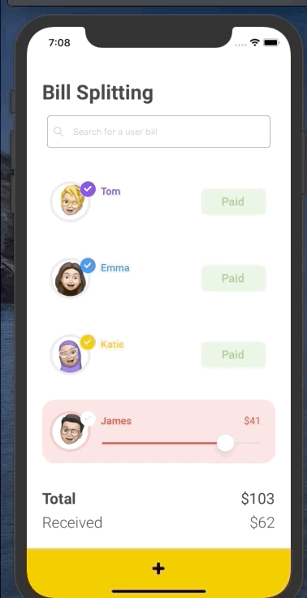
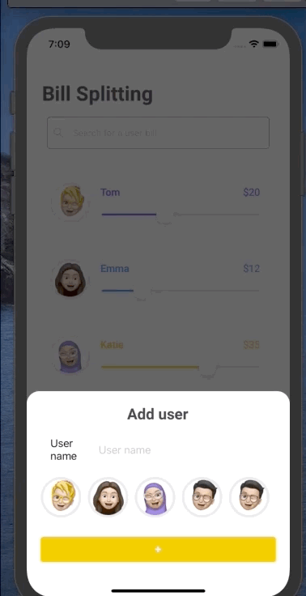

<p align="left">
   
</p>

# Bill Splitting

[](https://github.com/LauraBeatris)
[](#)
[](https://github.com/LauraBeatris/bill-splitting/stargazers)
[](https://github.com/LauraBeatris/bill-splitting/network/members)
[](https://github.com/LauraBeatris/bill-splitting/graphs/contributors)

> Split a bill with a group of users

Special thanks to [Andrea Hock](https://dribbble.com/andreahock) who created this [amazing layout](https://dribbble.com/shots/12035522--Bill-Splitting-App) and gave me the permission to develop it. 💛

---

# :pushpin: Table of Contents

* [Features](#rocket-features)
* [Installation](#construction_worker-installation)
* [Getting Started](#runner-getting-started)
* [FAQ](#postbox-faq)
* [Found a bug? Missing a specific feature?](#bug-issues)
* [Contributing](#tada-contributing)
* [License](#closed_book-license)

<p align="center">
  
  
  
</p>

# :construction_worker: Installation

**You need to install [Node.js](https://nodejs.org/en/download/), [Yarn](https://yarnpkg.com/), [Android SDK](https://medium.com/surabayadev/setting-up-react-native-android-without-android-studio-35a496e1dfa3) first and then, in order to clone the project via HTTPS, run this command:**

```git clone https://github.com/LauraBeatris/bill-splitting.git```

SSH URLs provide access to a Git repository via SSH, a secure protocol. If you have a SSH key registered in your Github account, clone the project using this command:

```git clone git@github.com:LauraBeatris/bill-splitting.git```

**Install dependencies**

```yarn install```

**Install IOS native dependencies**

```cd ios && pod install```

# :runner: Getting Started

Run the following command in order to start the application in a development environment:

```
  // Install the application in a Android device
  react-native run-android

  // Install the application in a IOS device
  react-native run-android
```

After the build process, the metro bundler will start the app automatically but
in case you already have the app built, just run the following command to start it:

```
yarn start
```

# :postbox: Faq

**Question:** What are the tecnologies used in this project?

**Answer:** The tecnologies used in this project are [React Native](https://reactnative.dev/), [Styled Components](https://styled-components.com/) and [Ant Design](https://rn.mobile.ant.design/docs/react/introduce)

# :bug: Issues

Feel free to **file a new issue** with a respective title and description on the the [Marketplace RN](https://github.com/LauraBeatris/bill-splitting/issues) repository. If you already found a solution to your problem, **i would love to review your pull request**! Have a look at our [contribution guidelines](https://github.com/LauraBeatris/bill-splitting/blob/master/CONTRIBUTING.md) to find out about the coding standards.

# :tada: Contributing

Check out the [contributing](https://github.com/LauraBeatris/bill-splitting/blob/master/CONTRIBUTING.md) page to see the best places to file issues, start discussions and begin contributing.

# :closed_book: License

Released in 2019.
This project is under the [MIT license](https://github.com/LauraBeatris/bill-splitting/master/LICENSE).

Made with love by [Laura Beatris](https://github.com/LauraBeatris) 💜🚀
